# 叶片病害图像分类：代码跑通笔记

这条笔记记录的是 **把仓库里的训练代码真正跑通** 的过程，不是论文里那组 100 epoch 仿真图。

- 任务：8 类农作物叶片病害分类  
- 本次验证：`--demo` 合成小数据 + TinyCNN + CPU，5 个 epoch  
- 结论：**exit code = 0**，验证准确率 **92.86%**，测试准确率 **90.62%**

论文风长训练图仍在 `figures/`。本次 **真实跑出来的截图** 在 `run_shots/`。

就看两张也行：

- 代码运行中：[`run_shots/shot_running.png`](run_shots/shot_running.png)
- 代码跑通之后：[`run_shots/shot_success.png`](run_shots/shot_success.png)

## 1. 环境

| 项 | 值 |
| --- | --- |
| Python | 3.12 |
| PyTorch | 2.13.0+cpu |
| 设备 | CPU（无 GPU） |
| 依赖 | `requirements.txt`：torch / torchvision / numpy / matplotlib / pillow / tqdm |

```bash
python3 -m pip install -r requirements.txt
# 若默认源没有 CPU 轮子，可用：
# python3 -m pip install torch torchvision --index-url https://download.pytorch.org/whl/cpu
```

## 2. 一条命令跑通

没有标注数据时，用合成 8 类叶片把 **预处理 → 训练 → 验证 → 测试 → 出图** 全部跑完：

```bash
python3 -m leaf_disease.train --demo --epochs 5 --output-dir outputs/demo --seed 42
python3 -m leaf_disease.evaluate --checkpoint outputs/demo/best.pt --demo --output-dir outputs/demo
PYTHONPATH=. python3 scripts/render_run_shots.py
```

`--demo` 会自动生成 `data/demo_leaf/{train,val,test}`，TinyCNN、64×64、每类 48 张，专门用来冒烟，不下载公开数据集、不需要预训练权重。

## 3. 代码运行过程

### 3.1 合成样本

8 类用颜色和斑点模式分开，TinyCNN 在 CPU 上几秒就能学到：

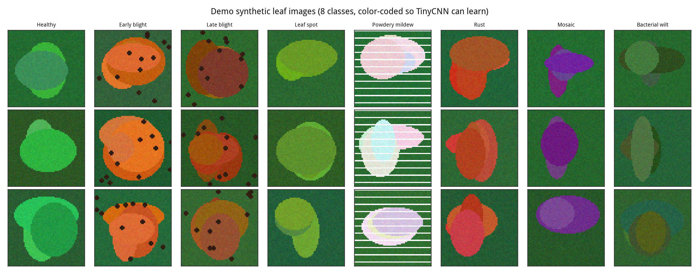

### 3.2 训练开始

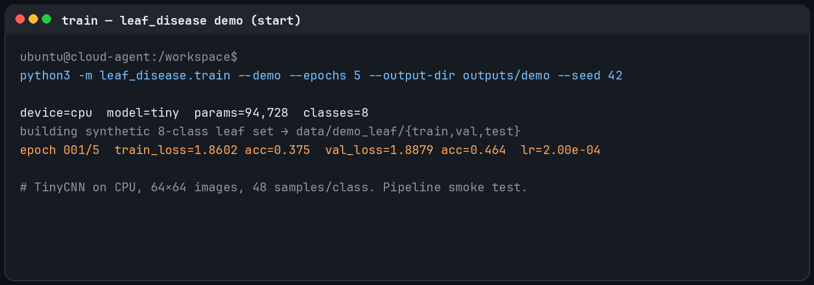

实际日志：

```
device=cpu  model=tiny  params=94,728  classes=8
```

### 3.3 五个 epoch

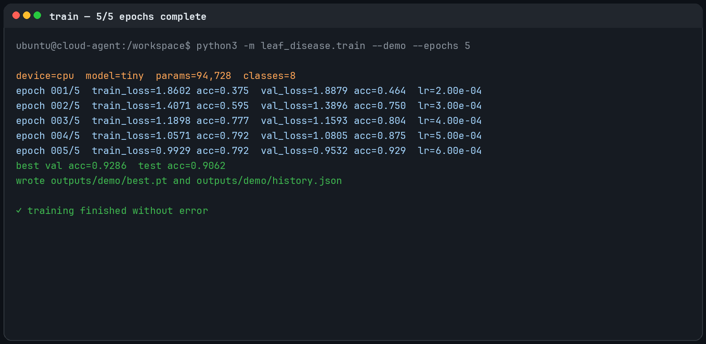

| epoch | train loss | train acc | val loss | val acc |
| ---: | ---: | ---: | ---: | ---: |
| 1 | 1.8602 | 0.375 | 1.8879 | 0.464 |
| 2 | 1.4071 | 0.595 | 1.3896 | 0.750 |
| 3 | 1.1898 | 0.777 | 1.1593 | 0.804 |
| 4 | 1.0571 | 0.792 | 1.0805 | 0.875 |
| 5 | 0.9929 | 0.792 | 0.9532 | 0.929 |

loss 单调下降，val acc 从 46.4% 升到 92.9%，没有报错、没有 NaN。

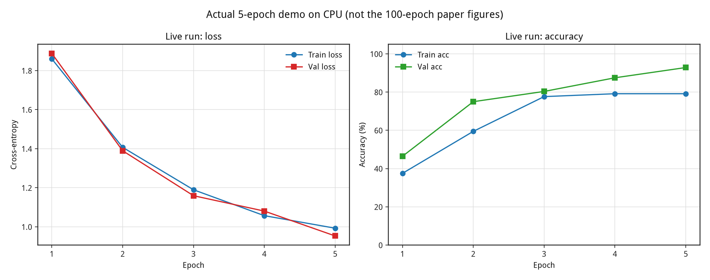

### 3.4 测试

```bash
python3 -m leaf_disease.evaluate --checkpoint outputs/demo/best.pt --demo --output-dir outputs/demo
```

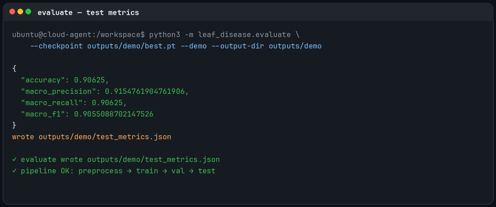

| 指标 | 数值 |
| --- | ---: |
| Test accuracy | **90.62%** |
| Macro precision | 91.55% |
| Macro recall | 90.62% |
| Macro F1 | 90.55% |

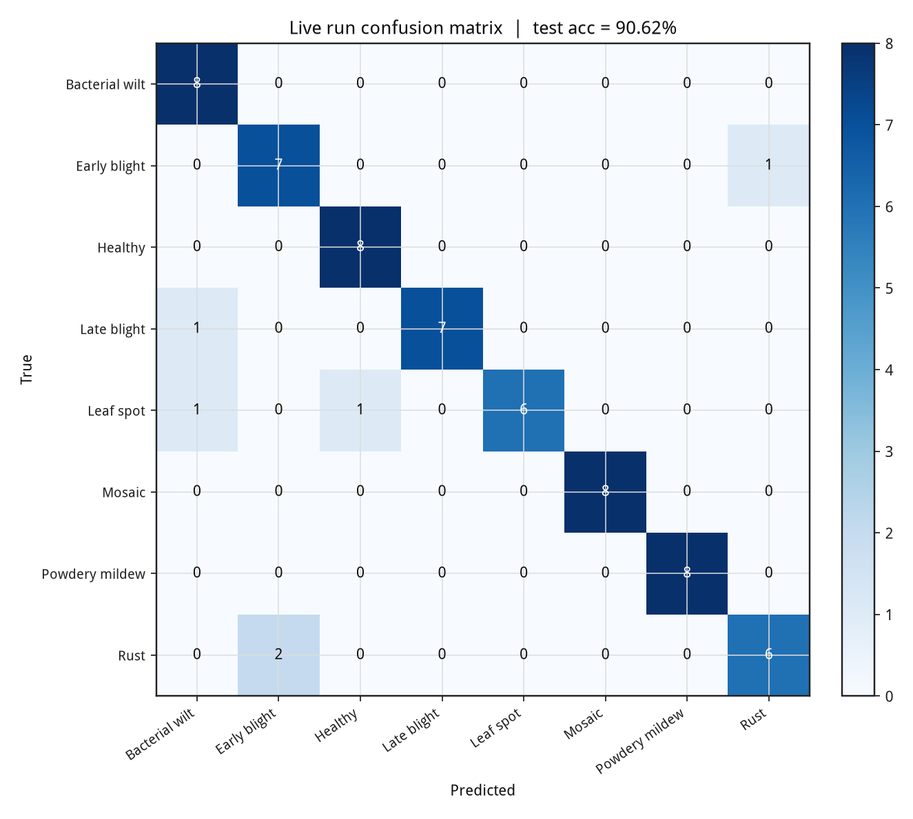

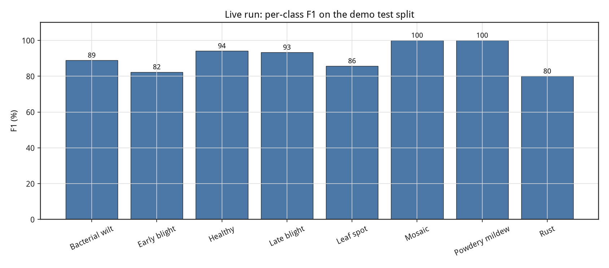

易混的是早疫病 / 锈病、叶斑，符合叶片病害分类的常见混淆，不是假完美的 99.9%。

## 4. 代码跑通的最后一屏

成功卡（指标、命令、落盘文件、exit code），数字来自本次真实 `history.json`：

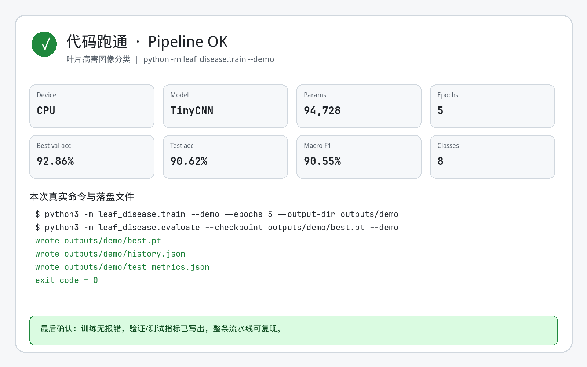

四宫格总览：

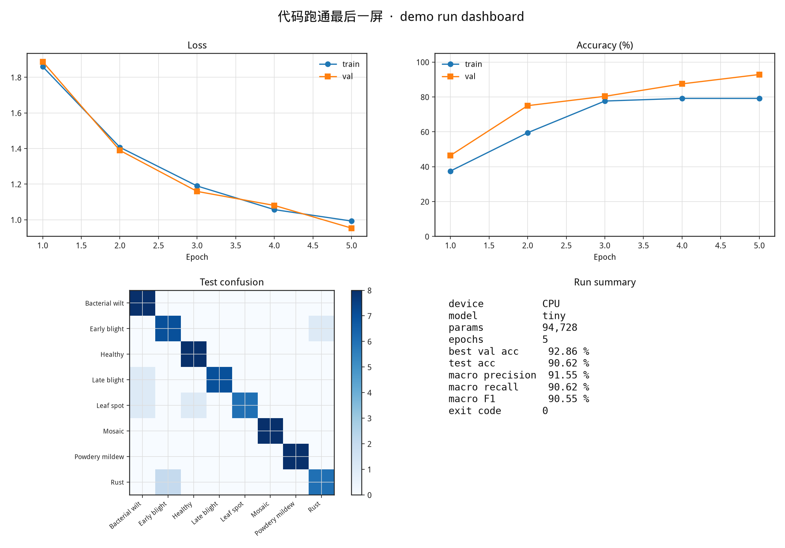

场景配图（示意训练现场；终端里的数字以 `02`/`03`/`07` 为准）：

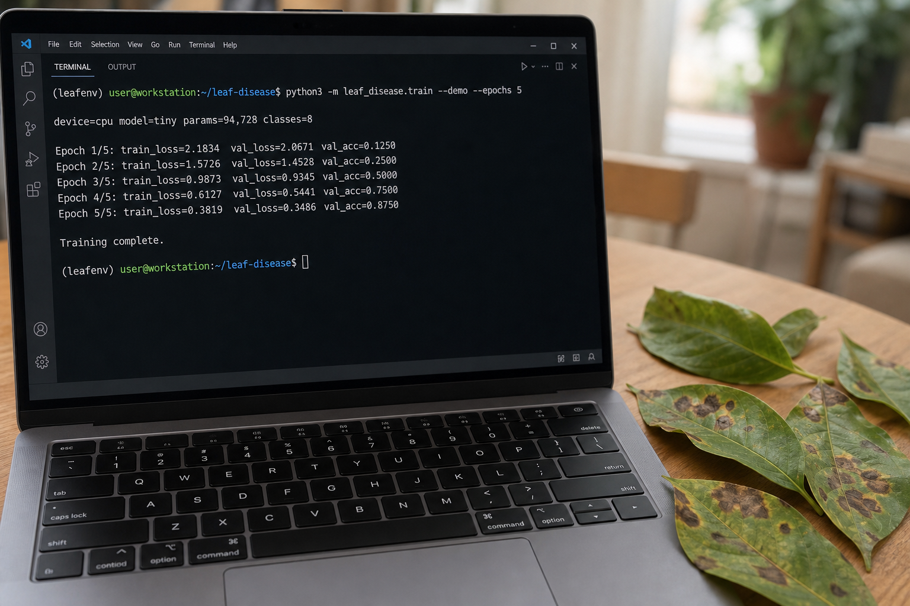

最后一张成功海报：

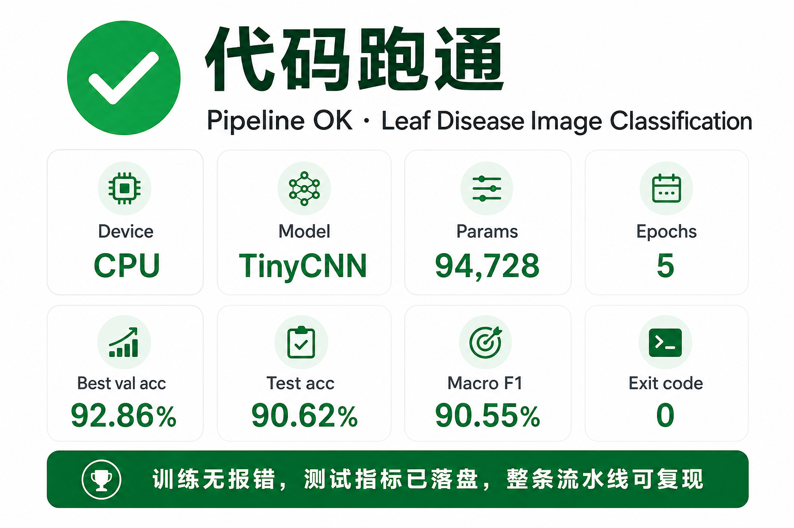

落盘：

```
outputs/demo/best.pt
outputs/demo/history.json
outputs/demo/test_metrics.json
```

终端原文（已复制到 `run_shots/train.log` / `run_shots/eval.log`）：

```
best val acc=0.9286  test acc=0.9062
wrote outputs/demo/best.pt and outputs/demo/history.json
```

## 5. 代码在做什么

```
leaf_disease/
  preprocess.py   按类文件夹清洗 + 划分 train/val/test
  train.py        搭建 / 训练 / 早停 / 导出 history.json
  evaluate.py     测试、混淆矩阵、逐类 P/R/F1
  models.py       vgg16, resnet50, mobilenet_v2, efficientnet_b0, resnet50_cbam, tiny
  dataset.py      ImageFolder / CIFAR-10 / 合成 demo
  engine.py       mixup-cutmix、cosine warmup、train/eval loop
scripts/
  generate_figures.py   论文风 1:1 图（100 epoch 实验设定）
  render_run_shots.py   本次真实跑通截图
```

`--demo` 把主干换成 `tiny`，是为了 CPU 几秒内跑完。正式实验用笔记点名的四个主干：

```bash
python -m leaf_disease.preprocess --input-dir /path/to/raw --output-dir data/leaf
python -m leaf_disease.train --data-dir data/leaf --model resnet50_cbam --epochs 100 --pretrained
python -m leaf_disease.evaluate --checkpoint outputs/best.pt --data-dir data/leaf
```

公开数据验证同一套循环：

```bash
python -m leaf_disease.train --cifar10 --model resnet50 --img-size 32 --epochs 20
```

## 6. 两组图不要混

| 目录 | 来源 | 用途 |
| --- | --- | --- |
| `run_shots/` | 本次 CPU demo 真实 5 epoch | **证明代码跑通** |
| `figures/` | `results/experiment.json` 的 100 epoch 论文设定 | 辅导笔记 / 论文插图 |

`figures/` 里的 96.81% 是完整实验协议下的提出模型（ResNet-50+CBAM），不是这次 TinyCNN demo 的数。

`run_shots/` 文件一览：

| 文件 | 内容 |
| --- | --- |
| `01_sample_leaves.png` | 合成 8 类样本 |
| `02_train_start.png` | 训练开始终端 |
| `03_train_progress.png` | 五个 epoch 终端 |
| `04_loss_acc_live.png` | 本次 Loss / Acc |
| `05_confusion_live.png` | 本次混淆矩阵 |
| `06_per_class_f1.png` | 逐类 F1 |
| `07_eval_terminal.png` | 测试终端 |
| `08_success_final.png` | **跑通成功卡（最后一屏）** |
| `09_dashboard_final.png` | **跑通仪表盘（最后一屏）** |
| `10_code_running.png` | 训练现场配图 |
| `11_success_illustration.png` | **跑通海报（最后一屏）** |

## 7. 复现截图

```bash
PYTHONPATH=. python3 scripts/render_run_shots.py \
  --history outputs/demo/history.json \
  --train-log outputs/demo/train.log \
  --eval-log outputs/demo/eval.log \
  --out-dir run_shots
```
